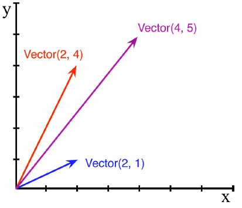

# Chapter01 - 파이썬 데이터 모델

데이터 모델은 일종의 프레임워크로서, *파이썬을 설명하는 것* 이라고 할 수 있으며, 시퀀스(sequences), 반복자(iterators), 함수(functions), 클래스(class), 콘텍스트 관리자 등 언어 자체의 구성단위에 대한 인터페이스를 공식적으로 정의한다. <br />파이썬은 *매직 메소드(특별 메소드, magic method)* 를 호출해서 기본적인 객체 연산을 수행한다. 매직 메소드는 `__getitem__()` 처럼 이중 언더바를 가지고 있다. 예를 들어, `obj[key]`형태의 구문은 `__getitem__()` 매직 메소드가 지원한다. `__getitem__()`과 같은 메소드를 읽을때에는 *던더(dunder) - getitem*이라고 부르는 것을 선호한다고 한다. 던더는 더블 언더바(double under)를 줄인 말이다. 따라서, 매직 메소드를 ***던더 메소드*** 라고도 한다.


## 1.1 파이썬 카드 한 벌

아래의 [예제 1-1]은 간단한 코드지만, 매직 메서드 `__getitem__()`과 `__len__()`만으로도 괜찮은 기능을 구현할 수 있다는 것을 보여준 예시이다. 이 코드는 카드(스페이드, 다이아몬드, 클로버, 하트) 한 벌을 나타내는 클래스`FrenchDeck` 이다.

```python
## 예제 1-1 : namedtuple을 이용한 카드 한 벌 클래스
import collections

Card = collections.namedtuple('Card', ['rank', 'suit'])

class FrenchDeck:
    ranks = [str(n) for n in range(2, 11)] + list('JQKA')
    suits = 'spades diamonds clubs hearts'.split()
    
    def __init__(self):
        self._cards = [Card(rank, suit) for suit in self.suits
                                        for rank in self.ranks]
        
    def __len__(self):
        return len(self._cards)
    
    def __getitem__(self, position):
        return self._cards[position]
```


[예제 1-1] 코드는 `collections.namedtuple()` 을 이용해서 구현 하였다. `collections.namedtuple()`에 대해서는 [여기](http://excelsior-cjh.tistory.com/entry/collections-%EB%AA%A8%EB%93%88-namedtuple?category=966334)를 참고하면 된다. <br />`FrenchDeck` 클래스는 `__len__` 메소드를 정의해 줌으로써  `len()` 함수를 통해 카드의 수를 반환 한다. 

```python
>>> deck = FrenchDeck()
>>> len(deck)
52
```


또한, `__getitem__` 정의를 통해, `obj[key]` 형태로 특정 카드를 읽을 수 있다. 예를 들어, `deck[0]`은 첫 번째 카드 이며, `deck[-1]`은 마지막 카드를 가져온다.

```python
>>> print(deck[0])
Card(rank='2', suit='spades')

>>> print(deck[-1])
Card(rank='A', suit='hearts')
```


이렇듯, 매직 메소드를 통해 파이썬 데이터 모델을 사용할 때의 두 가지 장점이 있다.

- 사용자가 표준 연산을 수행하기 위해 클래스 자체에서 구현한 임의 메서드명을 암기할 필요가 없다.
- 파이썬 표준 라이브러리에서 제공하는 기능을 별도로 구현할 필요 없이 바로 사용할 수 있다.


`__getitem__()` 메소드는 `self._cards`를 호출 하므로, 슬라이싱(slicing)도 당연히 지원한다. 

```python
>>> print(deck[:3])
[Card(rank='2', suit='spades'), Card(rank='3', suit='spades'), Card(rank='4', suit='spades')]

>>> print(deck[12::13])
[Card(rank='A', suit='spades'), Card(rank='A', suit='diamonds'), Card(rank='A', suit='clubs'), Card(rank='A', suit='hearts')]
```


`__getitem__()` 매직 메소드를 구현함으로써 deck을 리스트 형태 처럼 반복할 수도 있다.

```python
>>> for card in deck:
    	print(card)
Card(rank='2', suit='spades')
Card(rank='3', suit='spades')
Card(rank='4', suit='spades')
Card(rank='5', suit='spades')
Card(rank='6', suit='spades')
Card(rank='7', suit='spades')
...

>>> for card in reversed(deck):
        print(card)
Card(rank='A', suit='hearts')
Card(rank='K', suit='hearts')
Card(rank='Q', suit='hearts')
Card(rank='J', suit='hearts')
Card(rank='10', suit='hearts')
...
```


이 외에도 `in` 이나 정렬(sort)를 적용할 수도 있다. 교재에서는 정렬을 카드 (에이스가 제일 높고, 숫자가 같은 경우 스페이드 > 하트 > 다이아몬드 > 클로버 순) 순으로 정렬하는 코드를 아래와 같이 작성 했다. 

```python
# in 사용 예시
>>> Card('Q', 'hearts') in deck
True

# 정렬
>>> for card in sorted(deck, key=spades_high):
        print(card)

Card(rank='2', suit='clubs')
Card(rank='2', suit='diamonds')
Card(rank='2', suit='hearts')
Card(rank='2', suit='spades')
Card(rank='3', suit='clubs')
Card(rank='3', suit='diamonds')
...
```

 

`FrenchDeck` 클래스에 `__len__()`과 `__getitem__()` 매직 메소드를 구현함으로써 `FrenchDeck`은 마치 파이썬 시퀀스(ex. `list`) 처럼 작동하므로 반복, 슬라이싱 등이 가능하다. 


## 1.2 매직 메서드는 어떻게 사용되나?

파이썬 코드는 `my_object.__len__()`으로 직접 호출하지 않고, `len(my_object)` 형태로 호출한다. `list, str, bytearray` 등과 같은 내장(built-in) 자료형의 경우 파이썬은 위와 같은 형태로 호출한다. <br />매직 메소드는 종종 암묵적으로 호출된다. 예를 들어, `for i in x:` 문의 경우 실제로는 `iter(x)`를 호출하며, 이 함수는 다시 `x.__iter__()`를 호출한다. <br />매직 메소드를 호출해야 하는 경우, 일반적으로 `len(), iter(), str()` 등 내장함수(built-in function)을 호출하는 것이 좋다. 이러한 내장 함수가 해당 매직 메소드를 호출하기 때문이다. <br />

그렇다면, 각 클래스의 매직 메소드를 어떻게 확인할까? 각 클래스의 매직 메소드는 `dir(MyClass)`를 이용해서 해당 클래스의 매직 메소드를 확인할 수 있다. 아래의 코드는 매직 메소드를 확인하는 코드이다. 매직 메소드에 대해서는 [docs.python.org](https://docs.python.org/3.5/reference/datamodel.html) 에서 확인할 수 있다. 

 ```python
# ex) object를 상속 받은 클래스
>>> class MyClass:
    	pass

>>> print(dir(MyClass))
['__abs__', '__add__', '__and__', '__bool__', '__ceil__', '__class__', '__delattr__', '__dict__', '__dir__', '__divmod__', '__doc__', '__eq__', '__float__', '__floor__', '__floordiv__', '__format__', '__ge__', '__getattribute__', '__getnewargs__', '__gt__', '__hash__', '__index__', '__init__', '__int__', '__invert__', '__le__', '__lshift__', '__lt__', '__mod__', '__module__', '__mul__', '__ne__', '__neg__', '__new__', '__or__', '__pos__', '__pow__', '__radd__', '__rand__', '__rdivmod__', '__reduce__', '__reduce_ex__', '__repr__', '__rfloordiv__', '__rlshift__', '__rmod__', '__rmul__', '__ror__', '__round__', '__rpow__', '__rrshift__', '__rshift__', '__rsub__', '__rtruediv__', '__rxor__', '__setattr__', '__sizeof__', '__str__', '__sub__', '__subclasshook__', '__truediv__', '__trunc__', '__xor__', 'bit_length', 'conjugate', 'denominator', 'from_bytes', 'imag', 'numerator', 'real', 'to_bytes']
 ```


### 1.2.1 수치형 흉내 내기

아래의 그림과 같이 2차원 벡터를 나타내는 클래스를 구현해 매직 메소드를 사용하는 방법을 알아보도록 하자.



[예제 1-2]는 `__repr__(), __abs__(), __add__(), __mul__()` 매직 메소드를 이용해서 `Vector` 클래스를 구현한 코드이다.

```python
from math import hypot
#  https://docs.python.org/3/library/math.html#math.hypot

class Vector:
    
    def __init__(self, x=0, y=0):
        self.x = x
        self.y = y
        
    def __repr__(self):
        return 'Vector(%r, %r)' % (self.x, self.y)
    
    def __abs__(self):
        return hypot(self.x ,self.y)
    
    def __bool__(self):
        return bool(abs(self))
    
    def __add__(self, other):
        x = self.x + other.x
        y = self.y + other.y
        return Vector(x, y)
    
    def __mul__(self, scalar):
        return Vector(self.x * scalar, self.y * scalar)
```

```python
>>> v1 = Vector(2, 4)
>>> v2 = Vector(2, 1)
>>> print('__add__ 호출 :', v1 + v2)
__add__ 호출 : Vector(4, 5)
    
>>> v = Vector(3, 4)
>>> print('__abs__ 호출 :', abs(v))
__abs__ 호출 : 5.0

>>> print('__mul__ 호출 :', v * 3)
__mul__ 호출 : Vector(9, 12)
    
>>> print('__mul__ 및 __abs__ 호출 :', abs(v * 3))
__mul__ 및 __abs__ 호출 : 15.0
```


### 1.2.2 문자열 표현

`__repr__()` 매직 메소드는 객체를 문자열로 표현하기 위해 `repr()` 내장 함수에 의해 호출된다. 만약 `__repr__()`을 구현하지 않으면 `Vector` 클래스의 객체는 `<__main__.Vector at 0x255c338c550>` 이러한 형태로 출력이 된다. (위의 `Vector` 클래스에서 `__repr__()`을 지우고 실행하면 됨)

```python
# __repr__ 호출
>>> v1
Vector(2, 4)
```


이번에는 `__repr__()`과 비슷한 역할을 하는 `__str__()`을 비교해보자. `__str__()` 메소더는 `str()` 에 의해 호출되며 `print()` 함수에 의해 암묵적으로 사용된다. 즉, `print()`를 호출해야지 `__repr__()`과 같은 기능을 한다는 으미이다. 따라서, 두 매직 메소드 중 `__repr__()`을 구현하는게 좋다고 한다. 그 이유는 파이썬에서 `__str__()` 메소드가 구현되어 있지 않을 때 대책으로 `__repr__()` 메소드를 호출하기 때문이다. 아래의 `Vector2` 클래스는 `__repr__()` 대신 `__str__()` 매직 메소드를 사용한 클래스이다. 이 클래스를 이용해서 객체를 만들면, `print()`를 호출할때 문자열로 출력되는 것을 확인할 수 있다.

```python
class Vector2:
    
    def __init__(self, x=0, y=0):
        self.x = x
        self.y = y
        
    def __str__(self):
        return 'Vector(%r, %r)' % (self.x, self.y)
    
    def __abs__(self):
        return hypot(self.x ,self.y)
    
    def __bool__(self):
        return bool(abs(self))
    
    def __add__(self, other):
        x = self.x + other.x
        y = self.y + other.y
        return Vector(x, y)
    
    def __mul__(self, scalar):
        return Vector(self.x * scalar, self.y * scalar)
```

```python
>>> v4 = Vector2(3, 4)
>>> v4
<__main__.Vector2 at 0x255c33a5f60>

>>> print(v4)
Vector(3, 4)
```


*1.2.3 생략*

### 1.2.4 사용자 정의형의 불리언 값

파이썬에서 어떠한 객체 `x`가 **참**인지 **거짓**인지 판단하는 방법은 `bool(x)` 를 사용하며, 이 `bool()` 함수는 `True, False`를 반환한다. <br />

`__bool__()`이나 `__len__()`을 구현하지 않은 경우, 파이썬은 기본적으로 사용자가 정의한 클래스의 객체는 참(`True`)이라고 간주한다. `bool(x)` 는 `x.__bool__()`을 호출하며, `__bool__()`이 구현되어 있지 않으면, `x.__len__()`을 호출하며, 이 매직 메소드가 `0`을 반환하면 `bool()`은 `False`를 그렇지 않으면 `True`를 반환한다. <br />

위의 [예제 1-2]의 `Vector`클래스에서의 `__bool__()`은 벡터의 크기(`abs(self)`)가 `0`이면 `False` 를 반환하고, 그렇지 않으면 `True`를 반환한다.

```python
>>> v5 = Vector()
>>> bool(v5)
False

>>> v6 = Vector(1, 1)
>>> bool(v6)
True
```


## 1.3 매직 메소드 개요

파이썬 언어 참조 문서의 ['Data Model'](https://docs.python.org/3.5/reference/datamodel.html)에서는 83개의 매직 메소드를 설명하고 있다.

| 범주                  | 메소드 명                                                    |
| --------------------- | ------------------------------------------------------------ |
| 문자열/바이트표현     | `__repr__`, `__str__`, `__format__`, `__bytes__`             |
| 숫자로 변환           | `__abs__`, `__bool__`, `__complex__`, `__int__`, `__float__`, `__hash__`, `__index__` |
| 컬렉션 에뮬레이션     | `__len__`, `__getitem__`, `__setitem__`, `__delitem__`, `__contains__` |
| 반복                  | `__iter__`, `__reserved__`, `__next__`                       |
| 콜러블 에뮬레이션     | `__call__`                                                   |
| 콘텍스트 관리         | `__enter__`, `__exit__`                                      |
| 객체 생성 및 소멸     | `__new__`, `__init__`, `__del__`                             |
| 속성 관리             | `__getattr__`, `__getattribute__`, `__setattr__`, `__delattr__`, `__dir__` |
| 속성 디스크립터       | `__get__`, `__set__`, `__delete__`                           |
| 클래스 서비스         | `__prepare__`, `__instancecheck__` `__subclasscheck__`       |
| 단항 수치 연산자      | `__neg__ -`, `__pos__ +`,  `__abs__ abs()`                   |
| 향상된 비교 연산자    | `__lt__ >, __le__ <=, __eq__ ==, __ne__ !=, __gt__ >, __ge__ >=` |
| 산설 연산자           | `__add__ +, __sub__ -, __mul__ *, __truediv__ /, __floordiv__ //, __mod__` |
| 역순 산술 연산자      | `__radd__, __rsub__, __rmul__, __rtruediv__, __rfloordiv__, __rmod__, __rdivmod__, __rpow__` |
| 복합 할당 산술 연산자 | `__iadd__, __isub__, __imul__, __itruediv__, __ifloordiv__, __imod__, __ipow__` |
| 비트 연산자           | `__invert__ ~, __lshift__ <<, __rshift__ >>, __and__ &, __or__ |,__xor__ ^` |
| 역순 비트 연산자      | `__rlshift__, __rrshift__, __rand__, __rxor__, __ror__`      |
| 복합 할당 비트 연산자 | `__ilshift__, __irshift__, __iand__, __ixor__, __ior__`      |

*1.4 생략*

 ## 1.5 요약

매직 메소드를 구현하면 사용자가 정의한 클래스의 객체도 내장형 객체처럼 작동할 수 있어, 파이썬 스러운(Pythonic) 코딩 스타일을 구사할 수 있다.